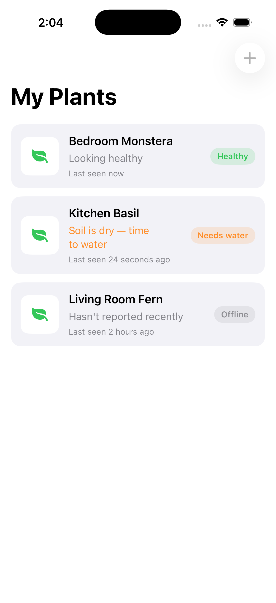
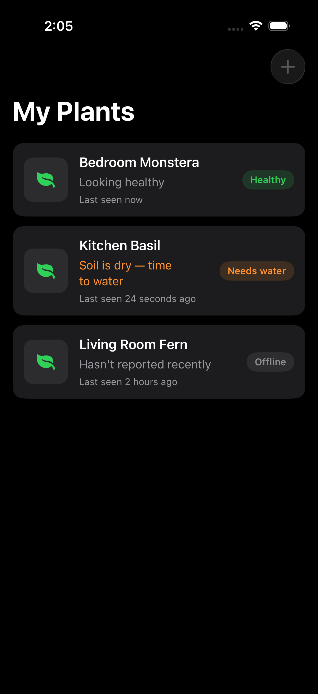
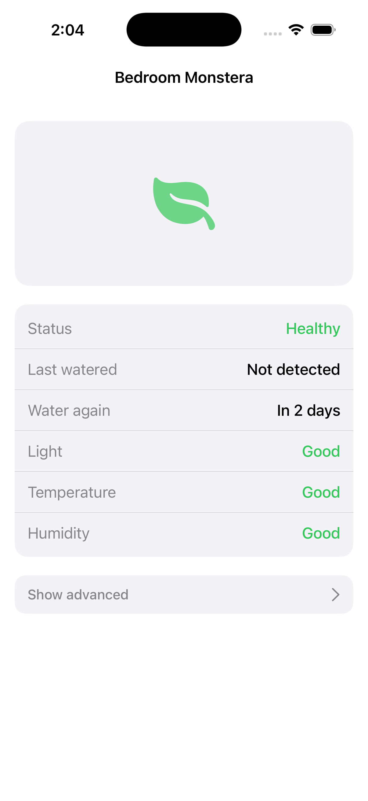
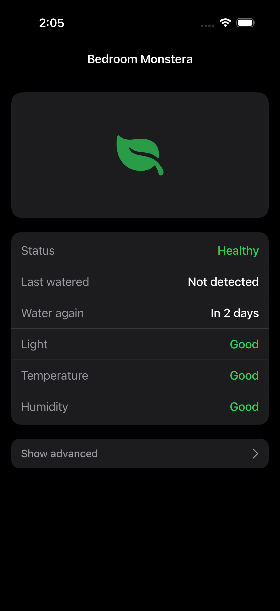
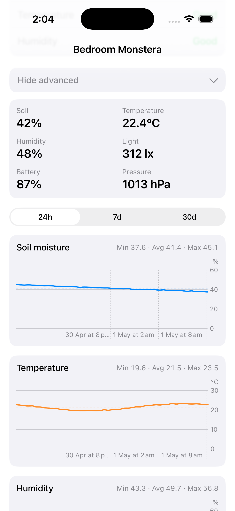
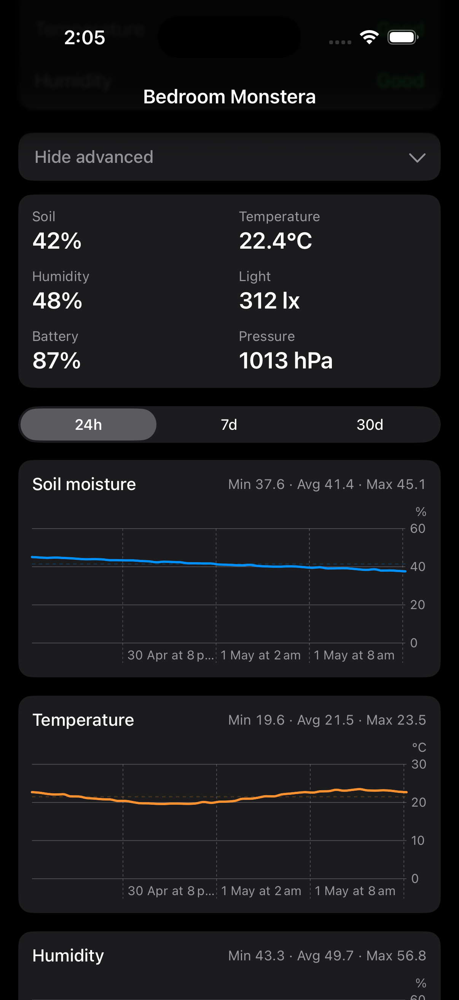
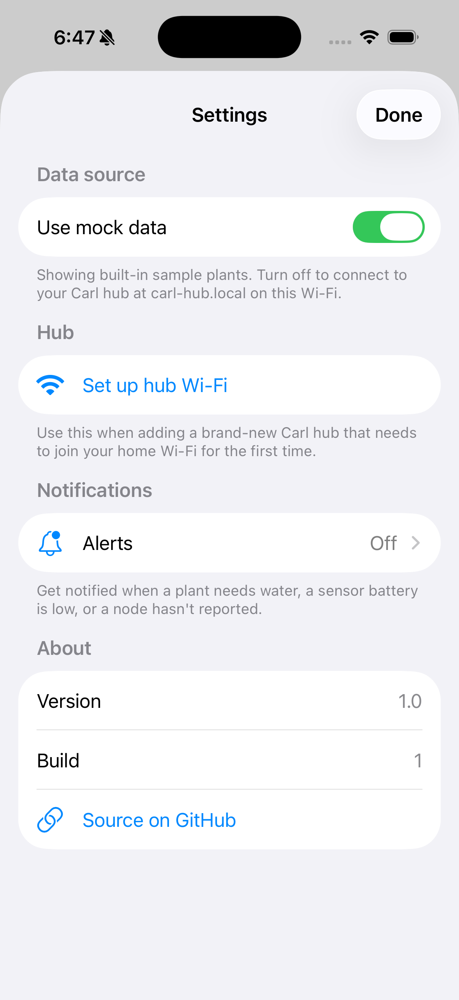
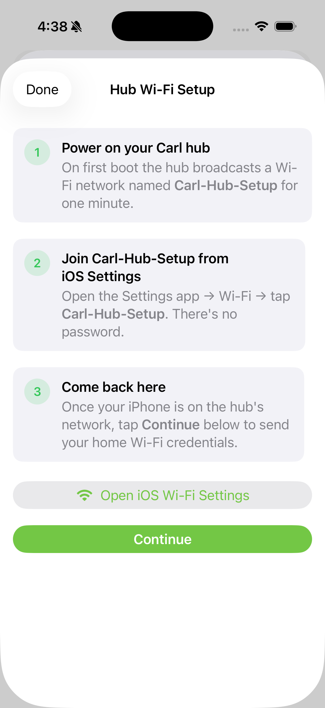
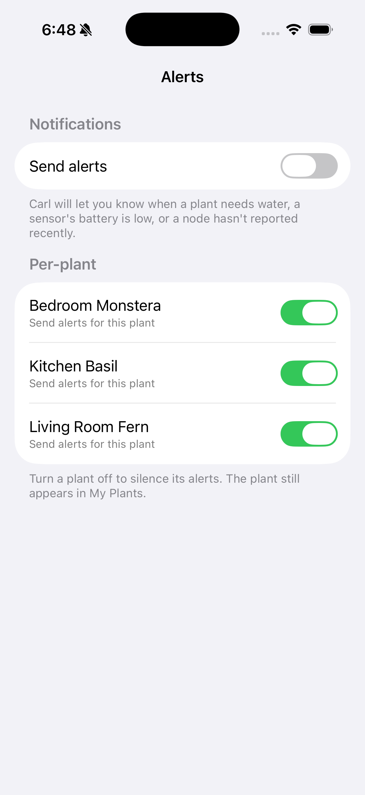

# Carl iOS — Design

This document is the shared reference for UI/UX collaboration on the Carl iOS app. It captures the design philosophy, the screen-by-screen breakdown with current screenshots, the underlying design system, and the open questions we'd want a designer's input on.

The screenshots are generated from the in-app `MockHubClient` (see [SETUP.md](../SETUP.md)) — they reflect what real plants will look like once the Carl hub HTTP API is live, just with fixture data.

---

## 1. Design philosophy

Carl's owners are plant lovers, not engineers. The interface should feel like **a friend who keeps an eye on your plants**, not a sensor dashboard.

Three rules shaping every decision:

1. **Words before numbers.** Default views say "Healthy", "Needs water", "Light: Good". Raw values (42 % soil, 22.4 °C, 312 lx) live behind an opt-in **Show advanced** disclosure for the curious.
2. **Action over diagnosis.** Tell the user *what to do* ("Soil is dry — time to water") before *what's wrong* ("Soil moisture below 25 %").
3. **Quiet when nothing's wrong.** A healthy plant should look calm — green pill, "Looking healthy" subtitle, and that's it. The interface only escalates colour and language when attention is needed.

System design notes:
- Uses **iOS semantic colours** (`secondarySystemBackground`, `tertiarySystemBackground`) so dark mode works automatically — no parallel palette to maintain.
- Status colour vocabulary is consistent across cards, pills, and the health table: **green = healthy**, **orange = needs attention**, **red = urgent (low battery)**, **gray = offline/unknown**.
- Apple Home / HomePod integration is intentionally **not** in the iOS app — it lives in the hub firmware (Matter bridge), so plants appear natively in the Home app and work even when the phone is asleep.

---

## 2. Screens

### 2.1 Home — *My Plants*

The first thing the user sees. A scrollable list of plant cards. Each card is a single tap target leading to detail.

| Light | Dark |
|---|---|
|  |  |

**What's on a card:**
- 56 × 56 photo placeholder (becomes the user-uploaded profile picture once the Norman photo endpoint ships).
- Plant name (bold).
- One-line, plain-language status subtitle that changes with the plant's condition:
  - *"Looking healthy"* (green-secondary)
  - *"Soil is dry — time to water"* (orange — calls action)
  - *"Sensor battery is low"* (red — urgent)
  - *"Hasn't reported recently"* (gray — quiet)
- Relative "Last seen" timestamp.
- Right-aligned **status pill** mirroring the subtitle's intent (Healthy / Needs water / Battery low / Offline).

**Interactions:**
- Pull-to-refresh.
- Tap card → Plant detail.
- `+` button (top-right): Add Plant — wired but disabled in this scaffold; lands in a follow-up commit.

**Empty/loading/error states** are handled by `ContentUnavailableView` and `ProgressView` (not shown in screenshots; covered in code at [HomeView.swift](../CarlApp/Features/Home/HomeView.swift)).

---

### 2.2 Plant detail — default health view

Tapping a card opens this. Photo header, then a single tidy table of plain-language health rows. **No numbers visible by default.**

| Light | Dark |
|---|---|
|  |  |

**Health rows in order:**

| Row | Possible values | Notes |
|---|---|---|
| **Status** | Healthy / Needs water / Battery low / Offline | Mirrors the home pill. |
| **Last watered** | "Today" / "Yesterday" / "*N* days ago" / "Not detected" | Detected as a soil-moisture rising edge (≥ +10 percentage points within ~1h). Falls back to "Not detected" when no event found in window — better honest than wrong. |
| **Water again** | "Now" / "Tomorrow" / "In *N* days" / "—" | Linear extrapolation from the last 12h drying rate to the dry threshold. "—" when soil isn't dropping. |
| **Light** | Good / Low / High / — | vs. generic indoor range 200–2000 lx. Will be per-species when catalogue lands. |
| **Temperature** | Good / Low / High / — | vs. 18–26 °C. |
| **Humidity** | Good / Low / High / — | vs. 40–70 %. |

The bottom **Show advanced** disclosure expands to the technical view (next screen).

---

### 2.3 Plant detail — advanced

For users who want the numbers. Disclosed by tapping **Show advanced**. Three sections, top to bottom:

| Light | Dark |
|---|---|
|  |  |

1. **Current readings grid** — Soil, Temperature, Humidity, Light, Battery, Pressure as labelled big numbers.
2. **24h / 7d / 30d** segmented picker — drives the chart and stats below.
3. **Chart cards**, one per metric (Soil moisture, Temperature, Humidity, Light):
   - Title + **Min · Avg · Max** for the selected period in the header.
   - Smooth-interpolated line plot (Swift Charts).
   - Faint dashed line at the average for visual anchoring.

The grid + charts cover the same ground the original "tech" view did, just one tap deeper.

---

### 2.4 Settings, Hub Wi-Fi setup, and Alerts

The gear icon (top-left of My Plants) opens a sheet with four sections: **Data source** (Mock / Real toggle), **Hub** (Set up hub Wi-Fi), **Notifications** (Alerts → detail screen), and **About** (version, build, GitHub link).

| Settings (light) | Hub Wi-Fi setup | Alerts |
|---|---|---|
|  |  |  |

**Hub Wi-Fi setup** is a step-by-step onboarding flow for a brand-new hub. Three step cards explain how to join the hub's `Carl-Hub-Setup` SoftAP from iOS Settings, an "Open iOS Wi-Fi Settings" deep link to make that one tap, then a **Continue** button to advance to the credentials form. The form `POSTs` to `http://192.168.4.1/api/setup/wifi` (the hub's captive-portal endpoint); the hub reboots into station mode on success, then appears again at `carl-hub.local`.

**Alerts** fire local notifications when a plant transitions into a `Needs water`, `Battery low`, or `Offline` state. Rate-limited to one notification per `(plant, condition)` every 6 hours so users aren't spammed. Master toggle requests `UNAuthorizationStatus` on first opt-in; if iOS has denied it, the screen shows an "Open in iOS Settings" affordance. Per-plant toggles below the master let users silence specific plants without losing them from the main list. Evaluation runs in two places: every foreground refresh of `HomeViewModel`, and once per `BGAppRefreshTask` wake (iOS schedules these opportunistically, typically every 30 min while the device is in use).

---

## 3. Design system

### Typography
- All built-in iOS dynamic type. No custom fonts.
- **`.headline`** — plant name on cards.
- **`.subheadline.weight(.medium)`** — chart titles, advanced toggle label.
- **`.caption`** / **`.caption2.weight(.semibold)`** — chips, pills, secondary metadata.
- **`.title3.weight(.semibold)`** — big numbers in the metrics grid.

### Colour
| Token | Light | Dark | Used for |
|---|---|---|---|
| `secondarySystemBackground` | very-light gray | dark gray | All card surfaces |
| `tertiarySystemBackground` | white | near-black | Photo placeholder |
| `.green` (system) | system green | system green | Healthy / Good |
| `.orange` (system) | system orange | system orange | Needs water / High / Attention |
| `.red` (system) | system red | system red | Battery low |
| `.blue` (system) | system blue | system blue | Soil-moisture chart, "Low" markers |
| `.gray` / `.secondary` | system | system | Offline, secondary text |

We never specify hex colours — every surface adapts to dark mode for free.

### Components
- **`PlantCardView`** — the home-screen card. Composes a photo placeholder, name + summary line, and a `StatusPill`.
- **`StatusPill`** — coloured capsule used both on cards and in the Status row.
- **`HealthRow`** — label/value row in the detail health table.
- **`Metric`** — small "label over big number" cell in the advanced grid.
- **`ChartCard`** — title + Min/Avg/Max header + Swift Chart line + dashed average rule.
- **Settings + HubSetup** — sheet-presented, Form-based; HubSetup uses a numbered step-card pattern.

All components live as private structs inside their feature folder; promote to a shared `Components/` group only when reused across features.

### Spacing & shape
- 14–16 pt card corner radius.
- 12–14 pt internal card padding.
- 12 pt gap between vertically stacked cards.
- 16 pt screen-edge inset.

---

## 4. Information architecture

```
My Plants                            (HomeView)
 ├── ⚙ Settings                      (SettingsView)
 │    ├── Use mock data toggle       (Mock / Real hub)
 │    ├── Hub Wi-Fi setup            (HubSetupView)
 │    ├── Cloud account              (NormanAccountView — sign in / create account)
 │    ├── Alerts                     (AlertsSettingsView)
 │    │    ├── Send alerts (master)
 │    │    ├── Per-plant mute toggles
 │    │    └── Recent fired log
 │    └── About                      (version / build / GitHub link)
 ├── Plant card × N                  (PlantCardView — plant or room node)
 │    └── Detail                     (PlantDetailView)
 │         ├── Health card           (plant: status/watered/water-again/L/T/H)
 │         │                          (room: status/L/T/H only)
 │         ├── Room environment card  (plants sharing a room_id, or the room node itself)
 │         └── Advanced (toggle)
 │              ├── Metrics grid     (soil metric hidden for room nodes)
 │              ├── Range picker  (24h / 7d / 30d)
 │              └── Chart cards × 3–4
 └── + Add plant                     (AddPlantView)
        ├── Plant photo              (camera / library / placeholder)
        ├── Species suggestion       (on-device Vision classifier → tappable pills)
        ├── Sensor node              (QR scan or manual MAC/key)
        └── Plant name               (auto-filled from accepted species suggestion)
```

Built today:
- **Home** with status pills + Settings sheet; room nodes show a "Room" badge and skip the soil-based status check.
- **Plant detail** with health card + advanced charts; room nodes get a dedicated "Room environment" card instead of watering rows, and plants linked to a room (`room_id`) show that room's ambient readings automatically.
- **Add plant** with QR scan, photo, manual entry, hub provisioning, **and on-device species detection** (Vision framework) that suggests a name and pre-fills species-specific calibration.
- **Settings** with Mock/Real source toggle, hub Wi-Fi setup, and a cloud account section.
- **Hub Wi-Fi onboarding** via captive-portal flow.
- **Alerts** — local notifications for dry soil, low battery, offline (foreground + background refresh).
- **Norman cloud fallback** — sign in once, and reads (plant list, detail, history) fall back to the cloud when the hub isn't reachable on LAN. Writes always stay hub-only.

Planned (not built):
- **Hub-claiming flow** — `POST /v1/hubs` isn't wired into the app yet, so a signed-in account has no hub associated with it and Norman has nothing to serve. This is the next priority — see the root [README](../README.md#future-plans).
- **Widgets** — home/lock-screen widget showing the worst-status plant.
- **Custom-trained species model** — today's classifier is Vision's built-in (coarse) classifier; a Create ML model trained on common houseplants is a drop-in upgrade to `PlantClassifier`.

---

## 5. Open questions for design collaboration

These are the decisions where a designer's input would materially shift the product:

1. **Photo placeholder.** Right now plants without a user-taken photo show an SF Symbol leaf (room nodes show a sensor icon). The Add Plant flow already supports camera + library; the placeholder only shows for plants the user hasn't photographed yet. Do we want a more polished placeholder (rotating illustrations? plant-type icons?) — or is the leaf fine?
2. **Watering as an event.** "Last watered" is currently detected from soil-moisture rises. Should the user also be able to log a watering manually ("I just watered the basil")? If yes, where does that affordance live — a button on the detail screen, a swipe action on the card?
3. **Notifications.** Local push for dry soil, low battery, offline. What's the right default — silent, banner, or both? Quiet hours? Per-plant mute?
4. **Apple Home hand-off.** When the hub firmware exposes Matter, the iOS app will offer "Add to Apple Home". Where does that affordance sit — inside Settings, on each plant's detail screen, or as a one-time setup step after hub onboarding?
5. **Empty state for Home.** The very first launch (no plants paired yet) should feel inviting and lead clearly into onboarding the hub + first plant. Currently it just shows `ContentUnavailableView`.
6. **Camera-node imagery (long-term).** The Carl camera node feeds the Norman ML pipeline for plant-health analysis. There's no plan today to surface the camera images themselves in the iOS app, but if Norman returns a "your plant looks healthy / wilted" verdict, where does that show up?
7. **Hub-claiming UX.** Signing in to a Norman account doesn't yet associate a hub with it (`POST /v1/hubs` has no UI). Where should that step live — folded into Hub Wi-Fi setup, or a separate "Link to cloud account" step? And how does the returned hub token actually get onto the hub itself?

Resolved since first written: the **plant catalogue** question is answered by the on-device species classifier + `SpeciesCatalog` (§2.4, §4), and **room vs. plant nodes** now render distinctly (status pill, detail layout, hidden soil rows) per Carl API v0.3.0's `node_type`/`room_id`.

---

## 6. Assets

- All screenshots in [screenshots/](screenshots/) are PNGs from the iPhone 17 Pro simulator (1206 × 2622 logical pixels).
- Regenerate via `xcrun simctl launch <device> com.projectcarl.CarlApp -screenshotEntry=<home|detail|detailAdvanced>` after wiring the screenshot shim back in (see commit history) and toggling appearance with `xcrun simctl ui <device> appearance light|dark`.

---

## 7. References

- App scaffold: [CarlApp/](../CarlApp/)
- Hub HTTP contract this UI consumes: [api/openapi.yaml](../api/openapi.yaml)
- High-level architecture across all three repos (Carl firmware, Norman cloud, this app): see the parent project plan in `~/.claude/plans/i-am-planning-to-pure-hamming.md`.
